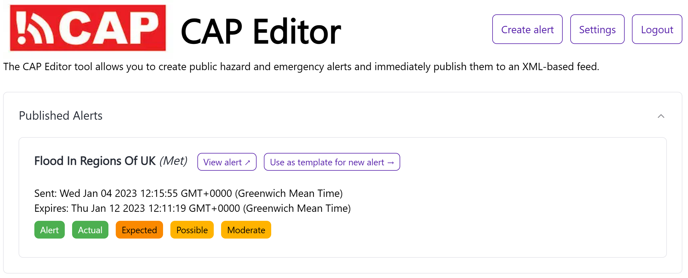
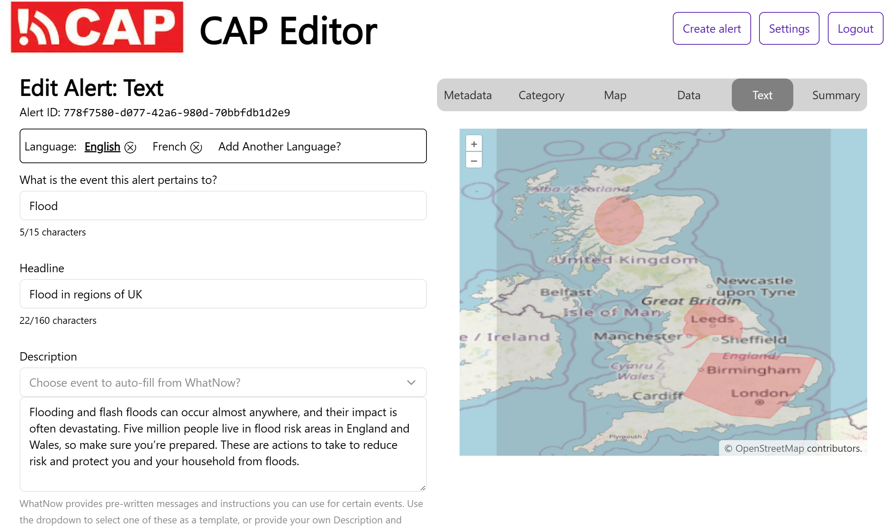

# CAP Editor

[](https://github.com/shu8/cap-editor/actions/workflows/test-backend-api.yml)
[](https://github.com/shu8/cap-editor/actions/workflows/test-frontend.yml)


The CAP Editor is a web-based platform for creating, reviewing, managing, and publishing [CAP v1.2](http://docs.oasis-open.org/emergency/cap/v1.2/CAP-v1.2-os.html)-formatted emergency and hazard alerts.

It has been created in collaboration with the [International Federation of Red Cross and Red Crescent Societies (IFRC)](https://www.ifrc.org/) as part of the [University College London (UCL)](https://www.ucl.ac.uk/) [Industry Exchange Network (IXN)](https://www.ucl.ac.uk/computer-science/collaborate/ucl-industry-exchange-network-ucl-ixn) by [Shubham Jain](https://sjain.dev).

Features:

- **Secure user authentication** with 'magic links' and usernameless [WebAuthn](https://www.w3.org/TR/webauthn-2/)
- **Internationalised interface** (English and French currently) using [LinguiJS](https://lingui.js.org/index.html).
- **[WMO Register of Alerting Authorities integration](https://alertingauthority.wmo.int/)**: users must be verified by their Alerting Authority to use the platform
- Create **template and draft alerts**
- Create **multilingual alerts**
- **User roles**: editor (create/edit draft alerts), validator (edit/publish draft alerts), administrator (create/publish any alert)
- **User-friendly alert creation UI**: individual steps, prefilled defaults, graphical map with circle/polygon drawing
- **[WhatNow](https://whatnow.preparecenter.org/) integration** for pre-filled multilingual alert instruction and descriptions
- **Digital Signatures** with [XMLDSIG](https://www.w3.org/TR/xmldsig-core1/)
- **Decentralised and easily deployable** with [Docker Compose](https://docs.docker.com/compose/)

Dashboard:

<p align="center">
  
</p>

Editor:

<p align="center">
  
</p>

## Usage

This platform is for use by Alerting Authorities. It can be installed by individual regions/Alerting Authorities for a fully functional CAP Editor that works out-of-the-box, with built-in access rights management and security.

## Architecture

This is a [Next.js](https://nextjs.org/) project.

In the below architecture diagram, the _feed server_ is this Next.js app.

<p align="center">
  
</p>

## Development

1. Ensure you have the following dependencies installed:

- Node v18+
- PNPM
- Docker
- Docker Compose

2. Create a [`.env`](./.env) file based on the [`.env.example`](./.env.example) file

3. Start the Docker containers (the development configuration at [`./docker-compose.yml`](./docker-compose.yml) includes [Mailhog](https://github.com/mailhog/MailHog), a fake SMTP server for easier development)

```bash
docker-compose up -d
```

4. Install the Node dependencies:

```bash
pnpm install
```

5. Run the database migrations:

```bash
pnpm db:migrate
```

6. Run the Next.js development server:

```bash
pnpm dev
```

Open [http://localhost:3000](http://localhost:3000) with your browser to see the result.

### Internationalisation (i18n)

This project uses [LinguiJS](https://lingui.js.org/index.html) for internationalisation.

Language catalogs are stored in [`./locales/[lang]`](./locales/) in the [PO format](https://localizely.com/po-file/).

Strings in the source code are written in English (UK) and must be wrapped in the `<Trans></Trans>` component from `@lingui/macro` package, or wrapped with the `t\`...\`` macro from the same package.

To update the files _to be translated_, run `pnpm i18n:extract`. Then, manually (or automatically using a translation tool), write in the translations for each of the strings in the [`./locales/[lang]/messages.po`](/.locales) files. Once translated, run `pnpm i18n:compile` to update the web-app to reflect the latest translations.

### Learn More

To learn more about Next.js, take a look at the following resources:

- [Next.js Documentation](https://nextjs.org/docs) - learn about Next.js features and API.

The `pages/api` directory is mapped to `/api/*`. Files in this directory are treated as [API routes](https://nextjs.org/docs/api-routes/introduction) instead of React pages.

## Deployment

Deployment is the same as the development steps, however step 4 is not required as the Next.js app will be built and run as a Docker Container when using the [`./docker-compose-prod.yml`](./docker-compose-prod.yml) configuration:

```bash
docker-compose -f docker-compose-prod.yml up -d --build
```

[Caddy](https://caddyserver.com/) is used as a web server and reverse proxy in the production configuration. The platform will be accessible on port 80 (redirected to HTTPS) and 443, so these ports must be whitelisted in any firewalls.

## TLS Certificate and Private Key

### Development

If you wish to sign alerts during development, you can either:

1. Set up HTTPS locally, or

2. Generate a key-pair using the command below and hen update `TLS_DIRECTORY=./` and `PRIVATE_KEY_FILENAME=cap-editor` values in the `.env` file

   ```bash
   ssh-keygen -m PKCS8 -t ecdsa -f $(pwd)/cap-editor
   ```

   _Note: a PKCS#8-formatted key is required._

   Signed alerts are cached, so if you have added this configuration after an alert was cached, you will need to empty the Redis cache (`FLUSHDB` inside `redis-cli` in the Redis Docker container is the easiest option in development environments).

### Production

By default, in production, this system uses Let's Encrypt certificates automatically generated and renewed using Caddy.

If you want to use a different Certificate Authority, you can edit Caddyfile to add the path to your certificate and private key. The filename of the private key **must** be added to the `.env` file under `PRIVATE_KEY_FILENAME`.

You'll also need to update the Docker Compose configuration to share the appropriate directory containing these files.
